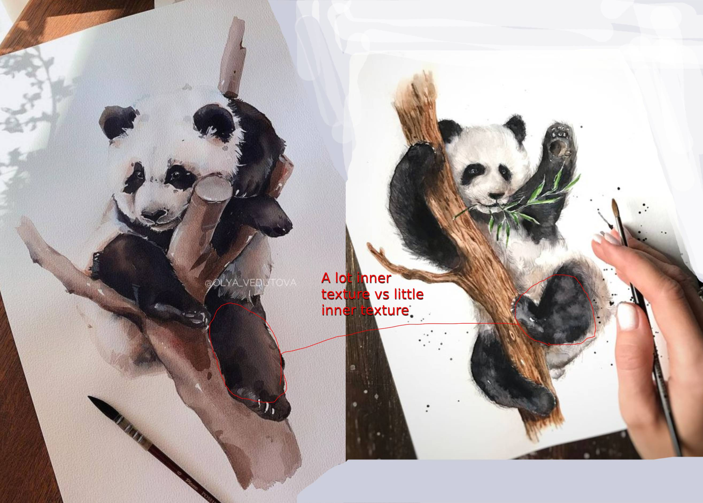
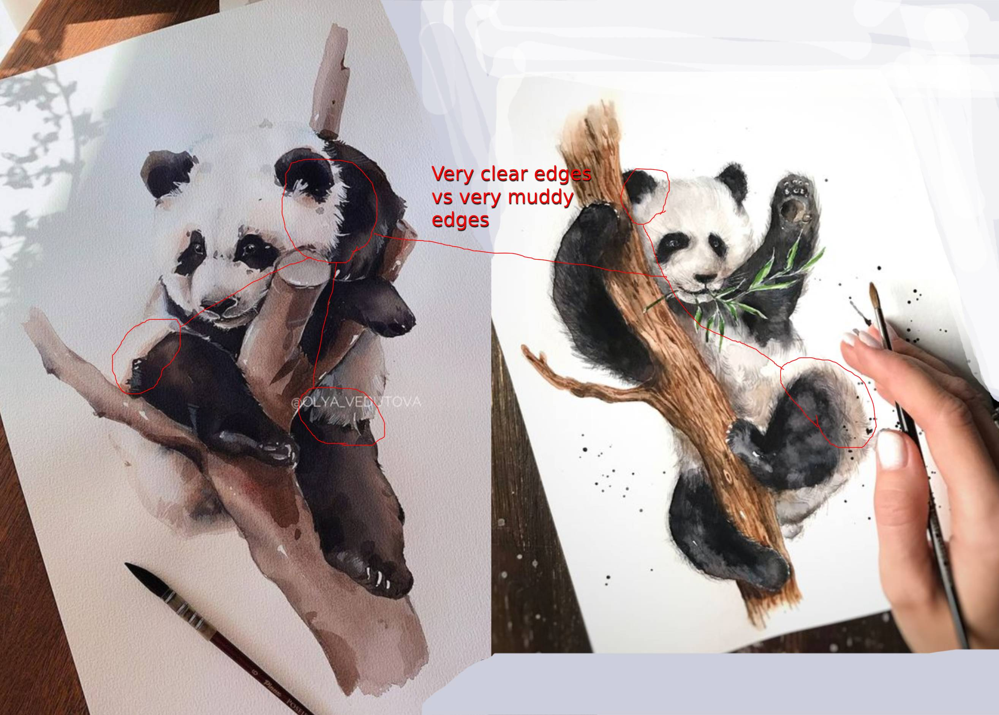

# Key Takeways

### Summary

* **Work slower**. The better painting was definitely done with more deliberate choices in color, detail and shapes. Which generally means slower.
* **Don't add texture everywhere**. I'm sure the left one's reference had a lot more details on the head and on the tree, but the artist left it out.
* **Show texture with edge work**. We know there are hairs on the face, not because we see the hairs on the face, but because we see the hairs of the white face overlap onto the black body.
* **Paint wet on dry more**. The good one has clear shapes, which is not possible with wet on wet. The bad one pretty much did the entire painting wet on wet. In the bad one, almost the only dry on wet work was done with the hairs on the arms and the tree vs the bear, other than that, everything was wet on wet.

| The Good One | The Bad One |
|-----------|-----------|
| Took more time (I think) | Finished faster |
| Deliberate edges | Scratchy/unsure edges |
| Deliberate colours | Muddy/mixed colors |
| Slower brushwork (I think) | Faster/less deliberate brushwork |
| Lower inner detail | A lot of inner detail |
| Many colour uses | Single color mindset (all tree is one color) |

