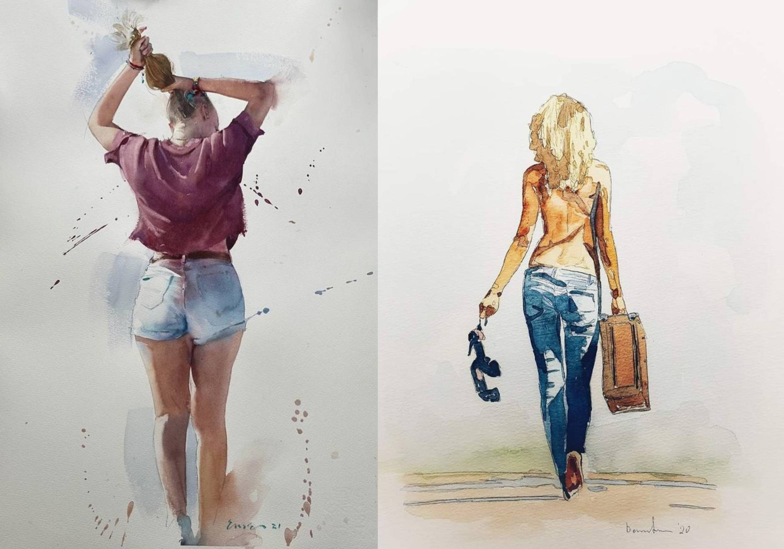
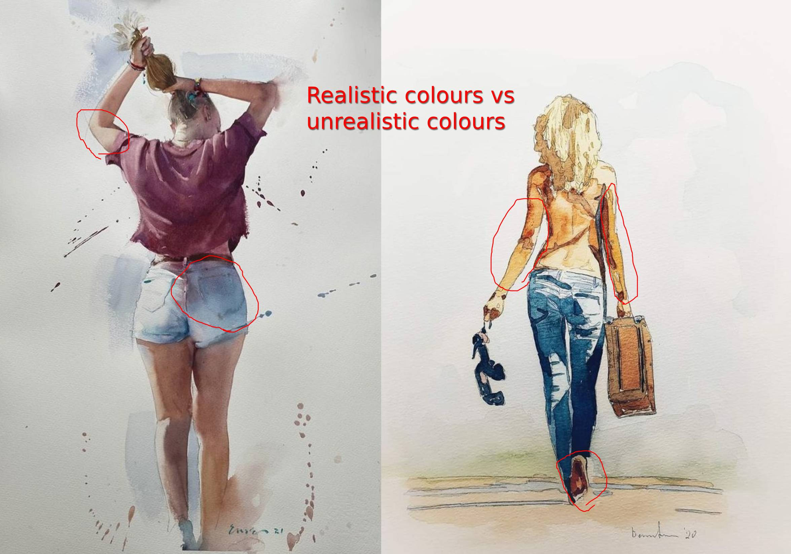
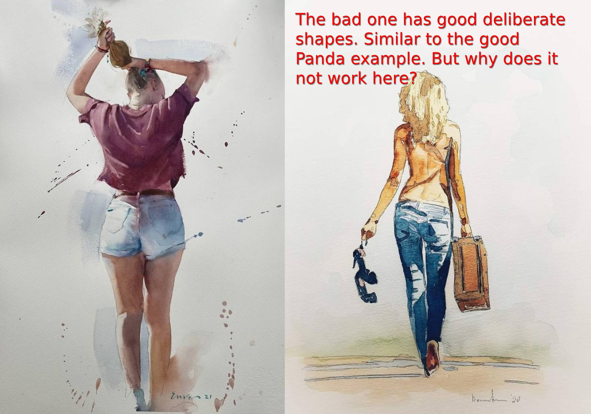
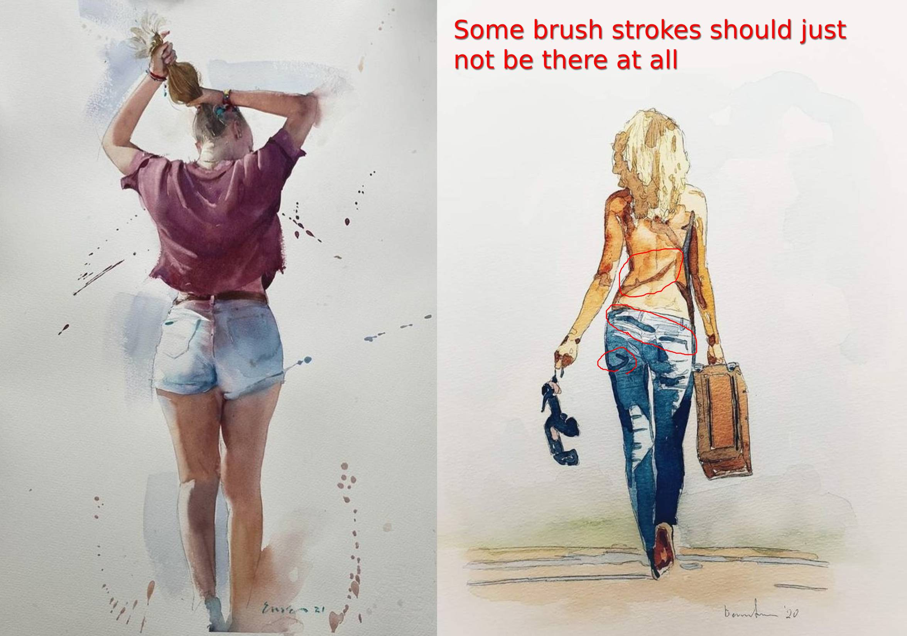
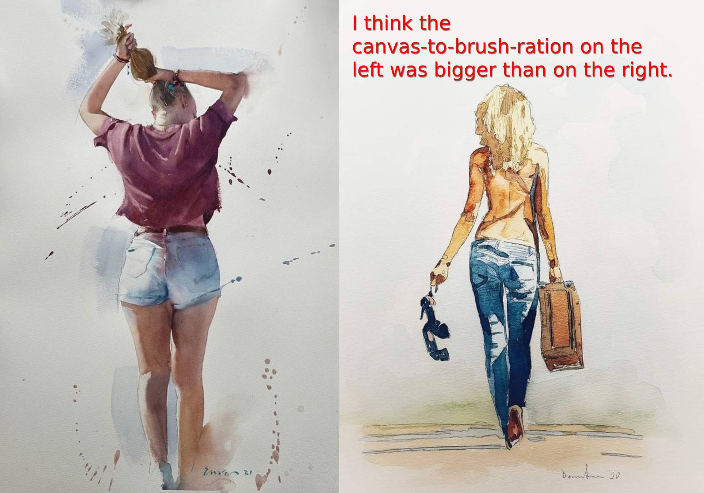
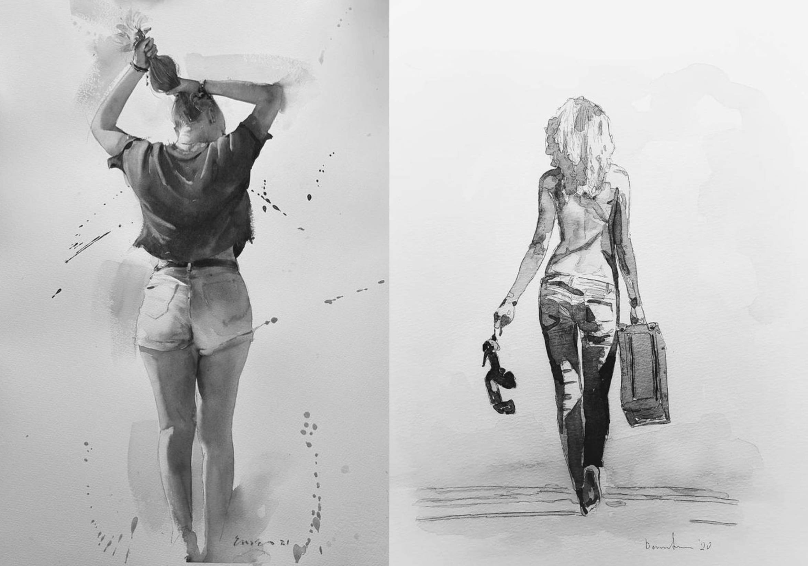
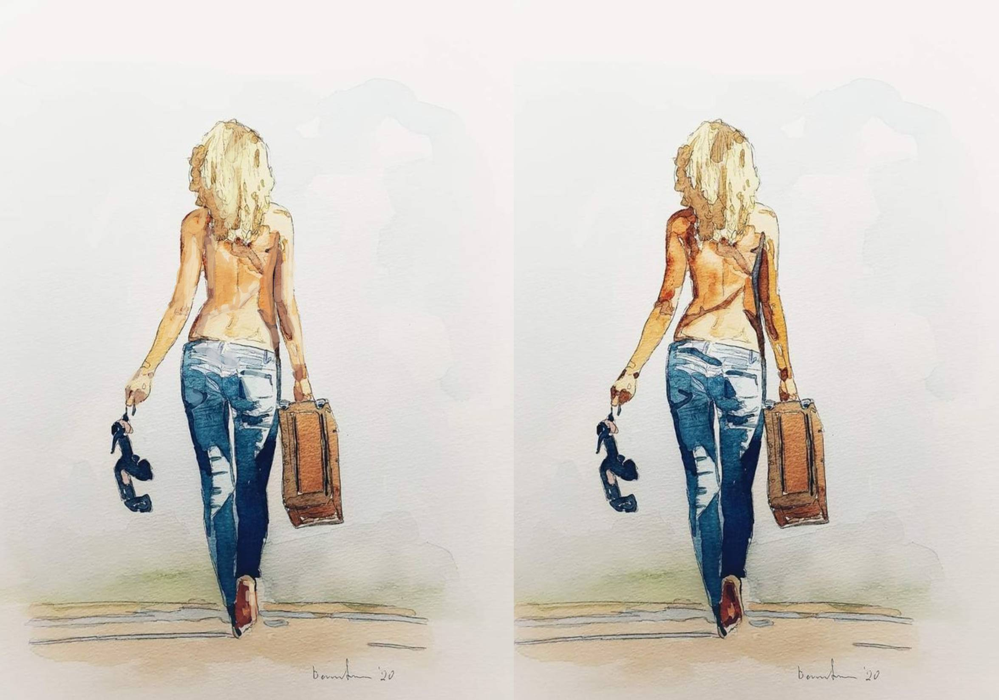
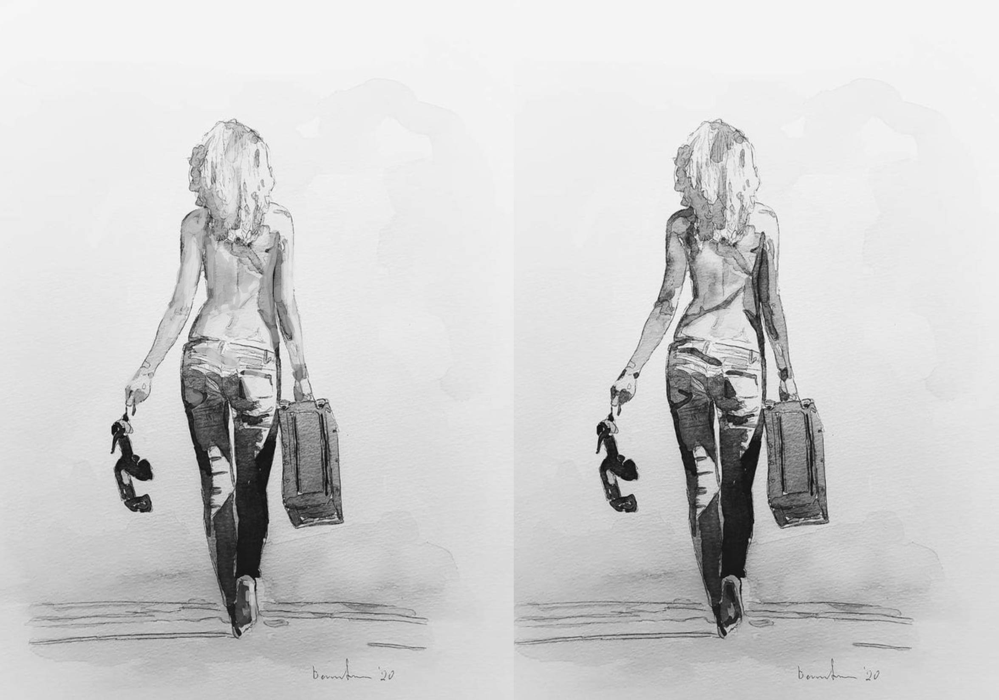

# Key Takeways

### Summary

* **Bigger canvas**. Painting with a bigger canvas to brush ration allows you to get in more details
* **Values are really important**. Notice how much better the painting got just by me fixing the values a bit.
* **Deliberate shapes don't work if the values are wrong**. Deliberate colour shapes (like in the Good-Panda example) don't make the painting better if the values are wrong.

| The Good One | The Bad One |
|-----------|-----------|
| Realistic colours | Too extreme colours |
| Large canvas to brush ratio | Small canvas to brush ratio |
| Good values | Bad values |

